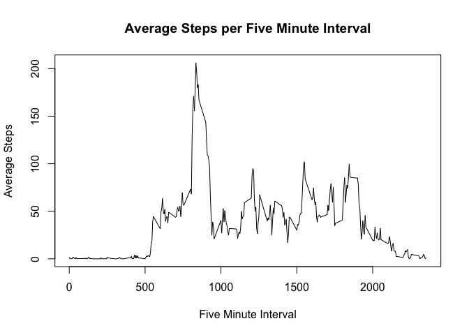
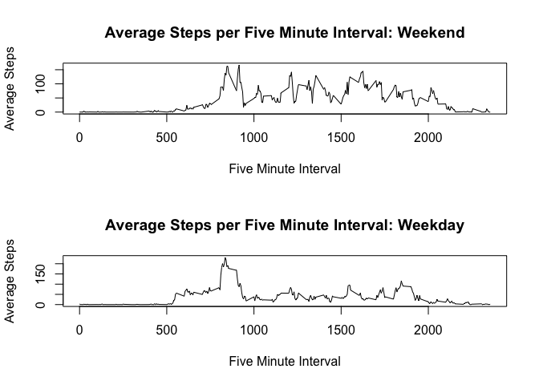

# Reproducible Research: PA1

## Loading and preprocessing the data  

The following code loads the data set into a data table for manipulation. The code assumes that the "activity.csv" file is accessible in the current working directory. After execution, the variable `dt` references a data table holding the data.


```r
library(data.table)
rawdata <- read.csv("activity.csv")
dt <- data.table(rawdata)
```

## What is mean total number of steps taken per day?  


```r
sums <- dt[,list(sumsteps = as.double(sum(steps, na.rm=TRUE))), by = c("date")]
hist(sums[,sumsteps], main="Histogram of total steps per day", xlab="Steps")
```

 

```r
tmean = mean(sums[,sumsteps])
tmedian = median(sums[,sumsteps])
```

The mean number of steps per day for this data set is: 9354.2295  
The median number of steps per day for this data set is: 1.0395 &times; 10<sup>4</sup>  

## What is the average daily activity pattern?  


```r
intmean <- dt[,list(meansteps = mean(steps, na.rm=TRUE)), by = c("interval")]
plot(intmean[,interval], intmean[,meansteps],type="l",xlab="Five Minute Interval",ylab="Average Steps",main="Average Steps per Five Minute Interval")
```

 

```r
maxinterval <- intmean[order(-meansteps),interval][1]
maxavsteps <- max(intmean[,meansteps], na.rm=TRUE)
```

Interval 835 has the highest average (mean) number of steps per day with 206.1698 steps.

## Inputing missing values  


```r
numna <- sum(is.na(dt))
```

There are 2304 rows containing NA values.  

To fill in the missing data, we will use the mean value for the five minute interval for each missing value, rounded to the nearest number of complete steps.  


```r
steps <- dt[,steps]

for(i in 1:nrow(dt)) {
  if(is.na(dt[i,steps])) {
    steps[i] <- as.integer(round(intmean[intmean$interval==dt[i,interval],meansteps]))
  }
}

dt$steps <- steps

sums <- dt[,list(sumsteps = as.double(sum(steps, na.rm=TRUE))), by = c("date")]
hist(sums[,sumsteps], main="Histogram of total steps per day", xlab="Steps")
```

 

```r
nmean = mean(sums[,sumsteps])
nmedian = median(sums[,sumsteps])
```

The new mean number of steps per day for this data set is: 1.0766 &times; 10<sup>4</sup>, a delta of 1411.4098 from the mean before filling in missing values.    
The new median number of steps per day for this data set is: 1.0762 &times; 10<sup>4</sup>, a delta of 367 from the median before filling in missing values.  

## Are there differences in activity patterns between weekdays and weekends?  


```r
days <- weekdays(as.Date(dt[,date], format="%Y-%m-%d"))
dayconv <- function(x) {
  if(x == "Saturday" || x == "Sunday") {
    return(as.factor("weekend"))
  }
  else { 
    return(as.factor("weekday")) 
  }
}
dt$day <- sapply(days,dayconv)

intmean <- dt[,list(meansteps = mean(steps, na.rm=TRUE)), by = c("interval","day")]

par(mfrow = c(2,1))
plot(intmean[intmean$day=="weekend",interval], intmean[intmean$day=="weekend",meansteps],type="l",xlab="Five Minute Interval",ylab="Average Steps",main="Average Steps per Five Minute Interval: Weekend")
plot(intmean[intmean$day=="weekday",interval], intmean[intmean$day=="weekday",meansteps],type="l",xlab="Five Minute Interval",ylab="Average Steps",main="Average Steps per Five Minute Interval: Weekday")
```

 

Examining the produced graphs, weekdays have a greater peak activity earlier in the day, while weekends show more steps taken during later intervals, and a more even distribution of steps during waking intervals. This likely reflects the increased leisure activities on weekends vs. more sedentary work activities during weekdays.
